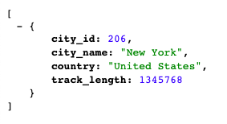

# ETL-project
by Ellen Hsu and Gary Schulke

We used **Python Pandas, NumPy, SQL (in PostgreSQL), SQLAlchemy and Flask**.

**Data Set:** [Transit Systems of the World](https://www.kaggle.com/citylines/city-lines/data#)

1. **Extract:** The original data set contained seven CSVs. We chose three that contained the column 'city_id': cities, stations, and track (length) and imported them into Pandas dataframes.

2. **Transform:** In Pandas, we copied only the relevant columns, renamed them, and dropped the null data. Then the track lengths were grouped and summed by city and converted from meters to miles.

3. **Load:** Using SQL (in PostgreSQL), we created empty tables corresponding to the new dataframes ([table_create_queries.sql](table_create_queries.sql)). 
    - In the first method, we used SQLAlchemy to load the data into each table and then joined them on 'city_id'. The result was a dataframe in Pandas.
    - In the second method, we joined them using a SQL query ([queries.sql](queries.sql)) in PostgreSQL. 
    - In the final step, we used the SQLAlchemy method in a Flask app that returned JSON results. One could also query for a city by simply typing it in the URL. A 404 error was returned if the city was not in the data set.

Example Routes: 
/api/v1.0/transit_systems 
/api/v1.0/transit_systems/London 
/api/v1.0/transit_systems/New York 

To preview this app on your local machine, please replace your PostgresSQL password in [config.py](config.py) and run app.py in your bash/terminal.  

Example Result: 
